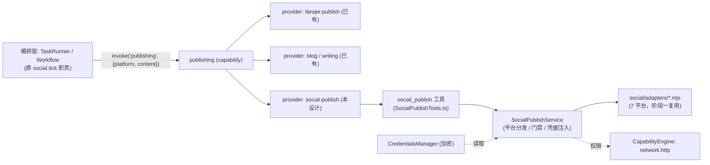

# Social Publishing Capability Design（publishing 能力域新增 social-publish provider）

> **Status:** Implementing（Phase 0–3 完成并验证；Phase 4 G1/G2 通过、G3 dry-run 已验、真实发送待人工确认；Phase 5 收尾中）
> **Date:** 2026-08-13
> **Upstream:** ADR-015 capability model contract（`publishing` taxonomy）; ADR-014 MCP Control Plane v1
> **Related:** `src/main/bootstrap/AppRuntime.ts`; `src/main/capability/*`; `src/main/tool/definitions/SocialPipelineTool.ts`; evolution workspace `social/`

## 1. Purpose

社交发布目前是"功能"形态而不是"能力"形态，这也是它反复出问题的根因。现状事实：

1. `publishing` 能力域已存在（`fanqie-publish` manifest 注册），但**没有 canonical `capabilitySchemas`**，CapabilityCatalog 只能 fallback 到通用 `{ description }` 契约，不符合 ADR-015 C-8（schema 非空）的意图。
2. 社交系统整体游离在能力模型之外：7 平台适配器、CLI、排程都是 evolution workspace 里的原始 `.mjs` 脚本；`AppRuntime.ts:1580` 的 `social.tick` 每 60s 直接 `node social/cli.mjs tick`（旧路径，已被重构删除），自 7/24 起每天报错数百次。
3. 半重构未提交：`social/workflows/cli.mjs` 内部路径仍按 `__dirname` 找 `workflows/` 下的 adapters/config/排程，实际文件在 `social/adapters/`、`social/config/`；git 里旧布局文件全部处于"已删除、未提交"状态（index.lock 自 7/23 锁死提交）。
4. 凭据是 evolution workspace 里的明文 `.creds.json`（7 平台全部），未进入 `CredentialsManager`（SQLite 加密）治理边界。
5. `SelfEvolutionPrompt` 让 LLM 用 `run_command node social/cli.mjs ...` 直调——正是 ADR-015 P1.3b Phase C 要消除的 raw tool 直调反模式；且 `tick` 路径不过 mode/平台开关门禁，修复后存在误发真实账号的风险。

本设计把社交发布提升为 ADR-015 `publishing` 能力域的一个正式 provider（`social-publish`），补齐 `publishing` 的 canonical 契约，将定时发布从"AppRuntime spawn CLI"改为"调度层调用能力"，并把凭据、门禁、审计纳入治理边界。

## 2. Goals / Non-Goals

### Goals

- 补齐 `publishing` 能力的 canonical `inputSchema`（C-8 合规），成为 fanqie / blog / social 共用的语义契约。
- 新增 `social-publish` provider：capability manifest + ProviderAdapter + 工具，复用现有 7 平台适配器实现。
- `social.tick` 改为调度驱动能力调用（TaskRunner → CapabilityService.invoke），移除 AppRuntime 直接 spawn。
- 凭据从明文 `.creds.json` 迁入 `CredentialsManager`（加密存储），provider 只经凭据管理读取。
- 发布门禁在能力边界强制：平台开关、mode 策略、风险词过滤、权限 `network.http`。
- 通过 health check（只读）+ dry-run + shadow 观察 gate 后才开放真实发布。

### Non-Goals

- 不重写 7 个平台适配器的发布算法（第一阶段继续复用 `social/adapters/*.mjs`，第二阶段再评估迁入 in-app）。
- 不处理内容生产工作流本身（`pipeline.mjs` 的格式化/配图/排程属于 content pipeline，单独演进）。
- 不做多 provider 路由/排序/回退（ADR-015 M5.3，deferred）。
- 不引入新运行时依赖。

## 3. 架构定位



边界划分：

| 层 | 归属 | 现状 → 目标 |
|---|---|---|
| 语义能力层 | `publishing` 能力域 | 无 canonical schema → 补齐；新增 `social-publish` provider |
| 编排层 | TaskRunner / Workflow | AppRuntime spawn CLI → 调度调用能力 |
| 治理层 | CapabilityEngine / CredentialsManager / Audit | 明文凭据、无门禁 → 加密凭据、能力边界门禁、审计事件 |
| 内容管线 | `social_pipeline`（pipeline.mjs） | 路径断裂 → 修复指向，与发布解耦 |

## 4. Design

### 4.1 补齐 `publishing` canonical 契约

在 `fanqie-publish` manifest 增加 `capabilitySchemas`（其它 provider 共用同一 canonical 输入，provider adapter 负责转换）：

```jsonc
{
  "publishing": {
    "type": "object",
    "properties": {
      "content":    { "type": "string", "description": "正文内容，必填" },
      "platform":   { "type": "string", "description": "目标平台: telegram/x/weibo/zhihu/douyin/xiaohongshu/wechat_mp，必填" },
      "title":      { "type": "string", "description": "标题（公众号等平台需要）" },
      "replyToId":  { "type": "string", "description": "回复目标 postId（可选）" },
      "dryRun":     { "type": "boolean", "description": "演练模式：只校验不真实发布（默认 false）" }
    },
    "required": ["content", "platform"]
  }
}
```

### 4.2 新增 `social-publish` provider

**Capability manifest**（注册进 MCPRegistry，方式与 `fanqie-publish` 一致）：

```ts
mcpRegistry.register({
  id: 'social-publish',
  name: 'Social Media Publishing',
  version: '1.0.0',
  runtime: { command: 'node', args: [] },
  capabilities: ['publishing'],
  capabilitySchemas: { /* 见 4.1，与 fanqie-publish 共用 */ },
  dependencies: [{ capability: 'publishing', tool: 'social_publish' }],
  permissions: ['network.http'],
})
```

**工具**：新文件 `src/main/tool/definitions/SocialPublishTools.ts`，输出 `social_publish`：
- 入参即 canonical 契约（`content` / `platform` / `title` / `replyToId` / `dryRun`）。
- handler 委托给 `SocialPublishService`，返回结构化结果（`{ platform, postId, url, requiresHumanPublish? }` 或错误）。

**ProviderAdapter**：新文件 `src/main/capability/adapters/social-publish-adapter.ts`，实现 `CapabilityProviderAdapter`，canonical → provider 参数直传（契约即参数，转换保持最小）：

```ts
export const socialPublishAdapter: CapabilityProviderAdapter = (input) => input
```

在 `AppRuntime` 注册：`capabilityService.setAdapter('social-publish', 'social_publish', socialPublishAdapter)`。

**服务**：新目录 `src/main/social-publish/`：
- `SocialPublishService.ts`：平台分发（映射到 7 个 `.mjs` adapter）、凭据注入（`credentialsManager.get` → 子进程 env）、风险词过滤、dryRun 短路。
- 阶段一：通过 `node social/workflows/cli.mjs publish <platform> <draft>` 或直接调用 adapter 的 `post()`；adapter 加载路径与配置路径对齐（修复 `workflows/cli.mjs` 的 `__dirname` 解析为 `../config` / `../adapters` / `../drafts`）。
- 阶段二（可选，另行立项）：把 7 个 adapter 迁为 in-app TS 模块，消除对运行时可写脚本的依赖。

### 4.3 编排层改造（替换 `social.tick`）

- 新组件 `SocialPublishScheduler`（in-app）：TaskRunner 仍注册 `social.tick` 节奏（60s），但逻辑改为：
  1. 读 `content_calendar.yaml`，筛出到期的 scheduled 项；
  2. 过门禁（平台 enabled / mode / 风险词，见 4.5）；
  3. `capabilityService.invoke(binding, { platform, content, title })`；
  4. 结果回写排程（published/failed/error）。
- `AppRuntime.ts:1580` 移除 `node social/cli.mjs tick` 的 spawn 代码。
- 好处：调度器不再知道 CLI 路径与脚本实现；发布行为统一走能力层（权限、审计、事件）。

### 4.4 凭据治理

迁移映射（`social/config/.creds.json` key → `CredentialsManager` key）：

| .creds.json | CredentialsManager |
|---|---|
| `TELEGRAM_BOT_TOKEN` / `TELEGRAM_CHAT_ID` | `telegram_bot_token` / `telegram_chat_id` |
| `X_BEARER_TOKEN` / `X_ACCESS_TOKEN` / `X_REFRESH_TOKEN` | `x_bearer_token` / `x_access_token` / `x_refresh_token` |
| `WEIBO_COOKIE` / `XHS_COOKIE` / `DOUYIN_COOKIE` / `ZHIHU_COOKIE` | 同名 |
| `WECHAT_MP_APPID` / `WECHAT_MP_SECRET` | 同名 |
| `SOCIAL_PROXY` | `social_proxy` |

- 迁移脚本（一次性，`scripts/` 或临时命令）：读取 `.creds.json` → `credentialsManager.set()` → 删除明文文件。
- provider 只通过 `credentialsManager.get()` 读取，子进程以 env 注入。

### 4.5 安全门禁（能力边界强制）

- **平台开关**：`config.yaml` 的 `platforms.*.enabled` 在 invoke 前校验（未启用平台直接拒绝）。
- **mode 策略**：`safe/assisted/autopilot` 在能力边界校验（`safe` 仅允许 draft/人工确认；`autopilot` 才允许自动回复类操作），不再依赖 CLI 内部硬编码。
- **风险词过滤**：保留现有 `risk()` 关键词表，在 `SocialPublishService` 执行，命中 `requires_review` 时返回 `requires_review` 而非发布。
- **权限**：manifest `permissions: ['network.http']`，走 ServerManager 内的 CapabilityEngine 校验与审计。

### 4.6 验证与推广 Gate

| Gate | 内容 | 通过标准 |
|---|---|---|
| G1 | 能力注册与解析 | `capability_catalog.rebuilt` 含 `publishing`；`resolve('publishing')` 返回 `social-publish` binding |
| G2 | 适配器健康（只读） | `adapters` 命令对 7 平台执行 `healthCheck`，记录健康矩阵 |
| G3 | Telegram dry-run | `dryRun: true` 不产生真实消息；去掉 dryRun 后向 Telegram 发送 1 条测试消息成功 |
| G4 | 观察期 | 发布事件（capability 事件 + 行为观测）无异常，连续 N 次 |
| G5 | 按平台推广 | 每平台单独通过 G3/G4 后再开放；cookie 类平台（微博/小红书/抖音/知乎）需人工刷新凭据后重验 |

### 4.7 文档与清理

- `SelfEvolutionPrompt.ts`：删除 `run_command node social/cli.mjs ...` 直调约定，改为描述 `publishing` 能力（`platform`/`content` 语义输入）。
- `SocialPipelineTool.ts`：修复 `PIPELINE_SCRIPT` 指向 `social/workflows/pipeline.mjs`（或随阶段二迁移），保持与发布解耦。
- CLI 帮助文案与 `social/workflows/*.md` 更新为新布局。
- 旧的 `social/cli.mjs` 直调约定、`social.tick` spawn 代码清理。

## 5. 分阶段实施

- **Phase 0（前置，运行时数据）**：清理 `evolution_workspace/.git/index.lock`；修复 `workflows/cli.mjs` 路径解析（`../config` / `../adapters` / `../drafts`），让 CLI 在当前布局可用。
- **Phase 1（能力壳）**：`publishing` schema 补齐 + `social-publish` manifest + adapter + `social_publish` 工具（后端先调 CLI）。
- **Phase 2（编排）**：`SocialPublishScheduler` 替换 `social.tick` spawn。
- **Phase 3（治理）**：凭据迁移 + 门禁强制 + 审计事件（已落地：`SocialPublishService` 门禁与凭据注入、`CredentialsManager.migrateFromSocialCreds` + AppRuntime 接线、迁移映射单测）。
- **Phase 4（验证推广）**：G1–G5 逐项通过后按平台开放（G1 跑通：`resolve('publishing')` → social-publish；G2 已重验，代理 `127.0.0.1:6179` 恢复后真实 `adapters` 健康矩阵：douyin/telegram/weibo/xiaohongshu/zhihu healthy；wechat_mp 返回 `40164 invalid ip`，需在微信公众平台后台将出口 IP `36.163.182.29` 加入白名单；x 当前凭据不可用——app-only bearer 打用户端点返回 403、OAuth2 user-context token 返回 401，需人工刷新用户上下文凭据后重验）。
- **Phase 5（收尾）**：文档对齐、`SocialPipelineTool` 路径修复、旧目录清理（已落地：`SelfEvolutionPrompt` 直调约定改为 `publishing`/`social_publish` 语义描述；`PIPELINE_SCRIPT` 指向 `social/workflows/pipeline.mjs`；CLI 头注释去直调；新增 `scripts/social-orphan-cleanup.mjs`：dry-run 默认、`--delete` 才删，已对副本验证；待人工确认后对真实 AppData 执行）。

## 6. 验收标准（Acceptance）

- [x] `publishing` capability 在 catalog 中带非空 `inputSchema`（C-8）。
- [x] `resolve('publishing')` 在无 toolHint 时可解析；`invoke` 走 adapter → `social_publish` → 平台 adapter 全链路。
- [x] AppRuntime 中不再存在 `node social/cli.mjs tick` 的 spawn 代码。
- [x] 7 平台凭据位于 `CredentialsManager`（迁移方法 + AppRuntime 接线；应用下次启动时写入并删除明文 `social/config/.creds.json`）。
- [x] 未启用平台 / 风险词命中 / mode 不允许时，invoke 被拒绝（`blocked`/`requires_review` + WARN 日志；权限 `network.http` 走 CapabilityEngine）。
- [ ] Telegram 真实发布通过 G3（事件总线 capability 调用记录已由单测覆盖：`capability.invoked`/`capability.completed`；dry-run 已验、真实发送待人工确认）；其余平台按 G5 逐项通过（G2 健康矩阵：douyin/telegram/weibo/xiaohongshu/zhihu 通过；wechat_mp 待加微信 IP 白名单；x 待刷新用户上下文凭据）。
- [x] `SelfEvolutionPrompt` 不再包含 `social/cli.mjs` 直调说明（改为 `publishing` 能力语义输入；CLI 头注释同步）。

## 7. 风险与决策点

- **平台适配器长期归宿**：留在 evolution workspace（脚本、可被 LLM 改写）vs 迁入 in-app（TS、受版本控制）。建议阶段二迁入，消除"能力依赖运行时可写脚本"的结构性风险。
- **cookie 凭据过期**：微博/小红书/抖音/知乎的 web cookie 自 6/27 未刷新，启用前需人工刷新。
- **自动发布的外部副作用**：真实发帖不可撤销（部分平台支持删除），以 Gate + 人工确认兜底，`autopilot` 默认不开放。
- **旧 social 目录清理时机**：等能力化稳定（Phase 5）后再删除，避免回滚路径丢失。
- **`publishing` 多 provider 共存**：fanqie / blog / social 共用同一能力，Resolver 的 provider 选择需要 toolHint 或优先级约定（M5.3 之前先用 toolHint）。